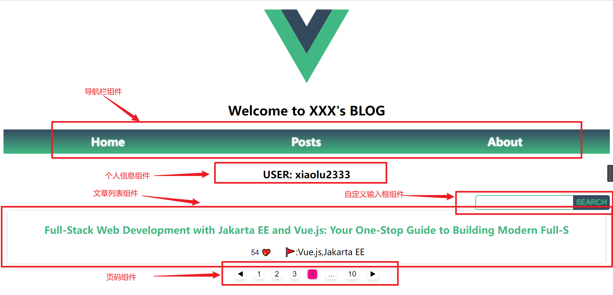
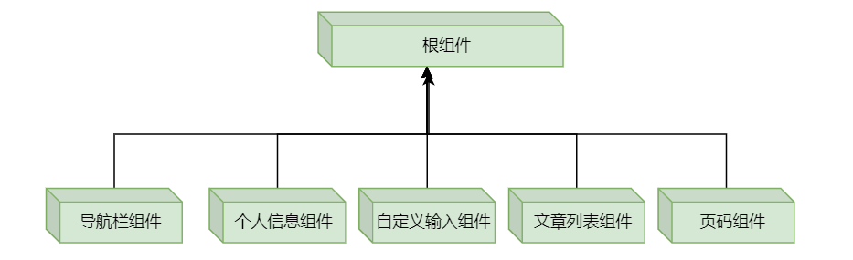

# demofrontend

简单博客应用的前端。

效果描述：

版本描述：V 1.0.0 

功能描述：在 demo 项目基础上，实现以下功能：
- 文章列表的获取与展示
- 文章列表页码的完美切割与折叠

实现描述：
1，应用完全组件化：

2，在根组件中通过 axios 从服务器接口获取文章所有数据
3，根组件将文章内容数据 porps 到文章列表组件中进行渲染
3，根组件将文章分页数据 porps 到页码组件中进行渲染


## Project setup
```
npm install
```

### Compiles and hot-reloads for development
```
npm run serve
```