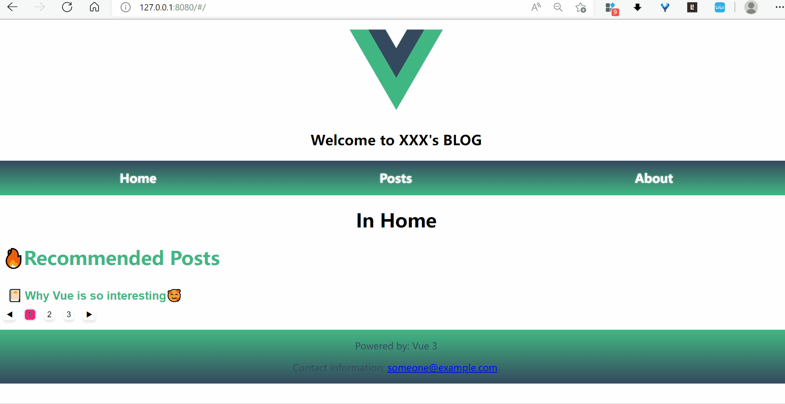
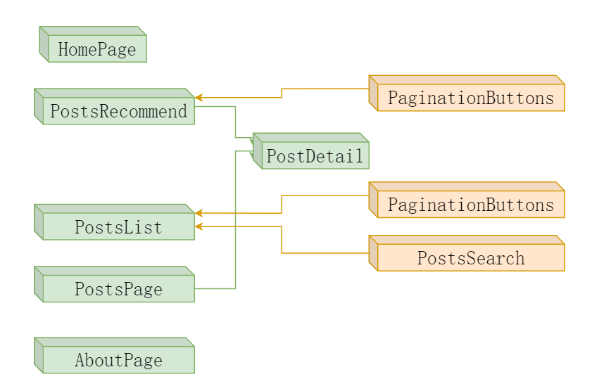

# myrouter

简单博客应用的前端。

效果描述：


版本描述：V 3.0.0 

功能描述：重构 myrouter 项目，实现以下功能：
- 文章点赞功能


实现描述：
1，重构路由与组件关系：


2，通过跨域发送 POST 请求的方式实现文章点赞功能。
- 后端要进行跨域配置，实现 CORS 跨域。
- 前端在 POST 之前请求CSRFtoken，在 POST 时添加到X-CSRFToken请求头，后端自动验证。


### Compiles and hot-reloads for development
```
npm run serve
```