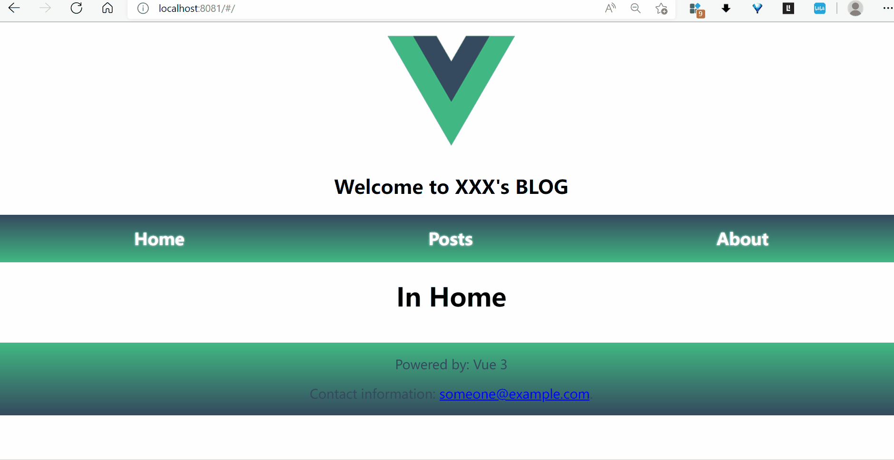
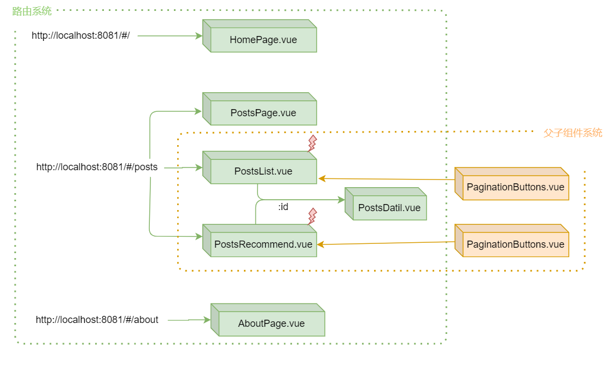

# myrouter

简单博客应用的前端。

效果描述：


版本描述：V 2.0.0 

功能描述：重构 myrouter 项目，实现以下功能：
- 分离文章列表和热门文章列表的获取与展示


实现描述：
1，使用路由与父子组件实现应用组件化：



## Project setup
```
npm install
```

### Compiles and hot-reloads for development
```
npm run serve
```